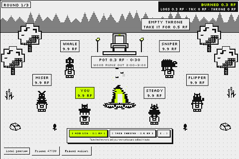

# Throne & Flame

A real-time strategy game for your Rare Friend, built on FriendSDK v0.1.2 for the Rare Friends Vibeathon
(Token Activity). You and five Friends play a 3-round season around a bonfire and a Harberger-tax throne:

- **The fire:** every log costs 0.1 RF. 40% burns, 50% feeds the pot and 10% pays the king. The last log before the
  fire dies takes the pot. The fire holds less time as the round goes on, and the wood runs out at a hidden moment
  between 2:00 and 3:00.
- **The throne:** the king declares their own price and pays 1% of it every 10 s as tax, all burned. Anyone can take
  the throne by paying that price (95% to the old king, 5% burned). In return the king collects the tribute of every log.

RF burns continuously, through logs, tax and takeovers, not only at the entry.

The scene is a forest clearing made from official FriendSDK props. It turns from day to dusk to night over the 3 rounds,
and the firelight shrinks as the fire dies.



**Play:** https://afurourrego.github.io/throne-flame/. It needs a browser wallet on Robinhood mainnet (chain 4663)
holding a hardwired Rare Friends Generations NFT (generation ≥ 1). Connecting only reads: no signatures, no
transactions, no RF. Everything economic is simulated.

## How to play
- **Add log** (Space): one per second.
- **Take throne** (T). As king, ← / → change your price; the bar shows your tax and tribute per minute.
- Every round starts with an opening log from everyone. The throne is not refunded at the end (hot potato).
- P / Esc or ≡ opens the menu (pause, sound, reduce motion, rules, leave season). M mutes.
- The ranking is by net profit.

## Economy (simulated)
| | |
|---|---|
| Consumable | Season, 10 RF (becomes your 10 RF season bag) |
| Settlement | Season 99% (0 RF) · Rekindle 1% (the 10 RF comes back), regardless of play |
| Burn sources | 40% of every log (and its 10% tribute when the throne is empty) · the king's tax (0.01% of the price per 0.1 s) · 5% of every takeover (all of an empty-throne purchase) · a pot nobody claims in round 3 |
| Invariant | balances + pot + burned = 60 RF on every tick (tested) |

Checked with our [RF Economy Lab](https://afurourrego.github.io/rf-economy-lab/) (the Economy Potential entry), using its
own functions: expected reward 0.1 RF per ticket, 10 RF reserved per play, and a 10 RF stake keeps sales open. The Lab's
"99% house edge" is an SDK artifact: the ticket goes to the bankroll because the SDK can't hand the season bag back,
while in the design those 10 RF are your stake at the table. Burn projection: 1,660–2,670 RF per 1,000 players per season.

FriendSDK v0.1.2 supports one consumable and one outcome table, so the season itself is an in-game ledger. In
production a contract would run the fire and the throne and burn on-chain, with all six seats played by real players.
The SDK has no online multiplayer, so the demo fills the other five seats with bots.

## Develop
Node ≥ 22.
```sh
npm ci
npm test              # unit tests
npm run test:balance  # headless balance suite: scripted players vs the bots, 120 seeds each
npm run check         # friendsdk check
npm run test:browser  # SDK test harness (mock wallet, automated only)
npm run dev           # local preview (real wallet gate)
npm run build         # static preview in games/throne-flame/.friendsdk/
```

Art tools:
- `python3 tools/logo.py`: the pixel logo.
- `python3 tools/home-webp.py`: the animated home background.
- `node tools/snapshot-friends.mjs`: snapshots the real Friends used as bots.

The pre-connect title screen is `games/throne-flame/host.css`, which only restyles the SDK runtime's own frame and menus.

## Layout
```
games/throne-flame/
  sim/      pure, seeded 10 Hz simulation: rules, ledger, fire, throne, bots, season
  economy/  the Season ticket over the SDK GameClient
  render/   480×320 1-bit scene, art, layout, effects
  ui/       React: title, HUD, action bar, menu, results
  audio/    Web Audio chiptune sounds and music
  host.css  the themed pre-connect screen
```

## Credits and licenses
- **Code:** Apache-2.0.
- **Friend artwork and runtime:** FriendSDK (see NOTICE.md). The bots are canonical sprites of real Generations Friends.
- **Fonts:** Silkscreen and Archivo, SIL Open Font License (`games/throne-flame/fonts/`).
- **Sounds:** the FriendSDK sound kit, plus chiptune sounds and music synthesized in code.
